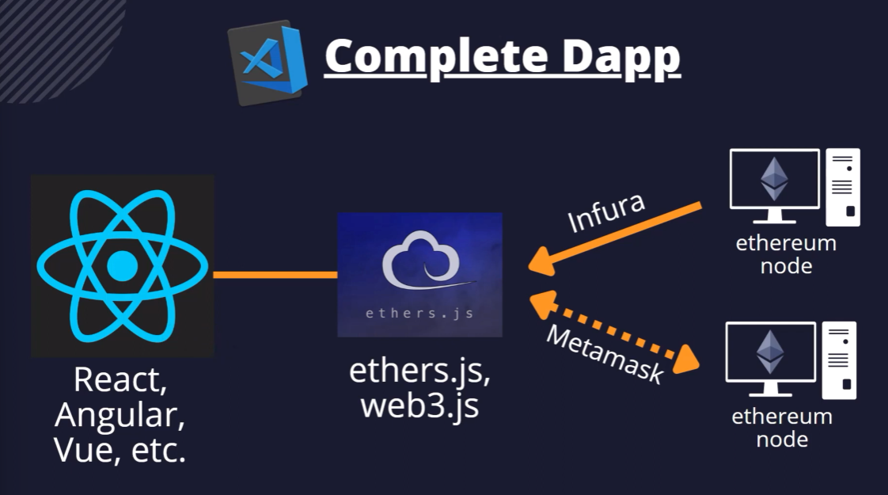

# Roadmap to Blockchain Development

## Blockchain

A blockchain is a public database that is updated and shared across many computers in a network.

"Block" refers to data and state being stored in consecutive groups known as "blocks". If you send ETH to someone else, the transaction data needs to be added to a block to be successful. The information stored in block is encrypted. Blocks are identified by long number that include the new transaction information and the transaction information of the previous block (parent block).

> The visual explanation of Blockchain blocks is available [here](https://andersbrownworth.com/blockchain/blockchain).

"Chain" refers to the fact that each block cryptographically references its parent. In other words, blocks get chained together. The data in a block cannot change without changing all subsequent blocks, which would require the consensus of the entire network.

Every computer in the network must agree upon each new block and the chain as a whole. These computers are known as "nodes".

## Types of Blockchain

### Core

In core blockchain development the developers create the blockchain client using low-level programming languages. EX: Ethereum Blockchain Developer, Polygon Blockchain Developer.

### Dapp

Usually blockchain developer refers to this category. Dapp (Decentralized app) developers create applications on top of the blockchain clients instead of creating the whole blockchain from scratch.

> We are going to learn Dapp development through this tutorial.

## Ethereum Blockchain

Most popular blockchain to develop Dapps. In the Ethereum universe, there is a single, canonical computer (called the Ethereum Virtual Machine, or EVM) whose state everyone on the Ethereum network agrees on. Everyone who participates in the Ethereum network (every Ethereum node) keeps a copy of the state of this computer. Additionally, any participant can broadcast a request for this computer to perform arbitrary computation. Whenever such a request is broadcast, other participants on the network verify, validate, and carry out ("execute") the computation. This execution causes a state change in the EVM, which is committed and propagated throughout the entire network.

Requests for computation are called transaction requests; the record of all transactions and the EVM's present state gets stored on the blockchain, which in turn is stored and agreed upon by all nodes.

Cryptographic mechanisms ensure that once transactions are verified as valid and added to the blockchain, they can't be tampered with later.

There are various concepts to learn. Read more about [Ethereum Blockchain](https://ethereum.org/en/developers/docs/intro-to-ethereum/).

Ethereum has two types of addresses. 1. Externally Owned Address (EOA) and 2. Contract Address. EOA refers to users accounts with private and public key, which hold funds for the addresses/users. On the other hand, contract addresses are those which stores smart contracts.

> Both the addresses share the same format of having 42 hexadecimal characters.

> Bitcoin blockchain only stores values like funds in an address, and does not support Dapps.

#### Mainnet

The main blockchain network in where all are real

#### Testnet

Ethereum provides testnet support to test the dapps in development mode for the developers who are developing dapps. It is similar to mainnet but all the transaction and eth values are only for test purpose.

#### Local Blockchain

Dapps developer can also create local blockchain like testnet in their own system.

## Smart Contract

A piece of code that constitutes a set of rules that lives on top of the blockchain. In practice, the participants don't write code every time they want to request a computation on the EVM (Ethereum Virtual Machine). The developers upload the smart contract in the blockchain and the users make requests to execute the contract with varying parameters.

Anyone can request that the smart contract code be executed by making a transaction request. Thus, with smart contracts, developers can build and deploy arbitrarily complex user-facing apps and services such as: marketplaces, financial instruments, games, etc.

> Dapp development is nothing but creating Smart Contracts for blockchain and UI for the users who want to execute the contracts.
> There are a few programming languages to write smart contracts like Solidity, Rust, Vyper, Yul etc.

## Gas

It is the unit of account within the EVM used in the calculation of a transaction fee. The transaction's sender has to pay. On the other hand the miner (the node that validate the block to insert into the blockchain) will get the fee. Each transaction has a specific Gas fee. The sender can raise the gas fee to get validate early in the blockchain.

> Blockchain transaction

## Wallet

Wallet are similar to holder of the web3 account details. Wallet holds the private and public keys of a user account. For Ex: Metamask, Trust etc

## Tools & Languages

### Solidity

Is a contract-oriented high-level programming language for implementing smart contracts. It was designed to target the EVM and influenced by C#, Python and Javascript.

The official documentation is - [Solidity](https://docs.soliditylang.org/en/v0.8.18/)

### Hardhat

Ethereum development environment for professionals. Is a tool that facilitates creating a local blockchain, deploying smart contracts, run solidity codes locally. There are also many tools like hardhat. For Ex: Truffle, Ganache. But hardhat is very flexible, extensible and fast.

The official documentation is - [Hardhat](https://hardhat.org/docs)

### Ethers JS

The ethers.js library aims to be a complete and compact library for interacting with the Ethereum Blockchain and its ecosystem. It helps to connect the frontend of a Dapp to the blockchain. There are also many library like ethers. For Ex: web3.js

The official documentation is - [Ethers](https://docs.ethers.org/v5/)

### API Providers

Infura is a scalable backend infrastructure provider for building dapps on the Ethereum blockchain. Infura provides APIs to get data from blockchain without using wallet. It also have other tools like IPFS (Inter Planetary File System) API.

> Alchemy is also another provider like Infura.

